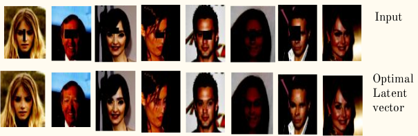

## Semantic Image Inpainting using DCGAN
CS736 Project:  
1)Parth Shettiwar: 170070021  
2)Prajval Nakrani: 17D070014  
3)Harekrissna Rathod, 17D070001  

This is a pytorch implementation of the paper [Semantic Image Inpainting with Deep Generative Models](https://arxiv.org/abs/1607.07539)    

The DCGAN training was done for 50 epochs using reference from [Pytorch DCGAN Tutorial](https://pytorch.org/tutorials/beginner/dcgan_faces_tutorial.html) to get the trained weights used for training optimal latent vector.  

Following are the results from the implmentation after running for 1500 iterations in finding optimal latent space vector.  

